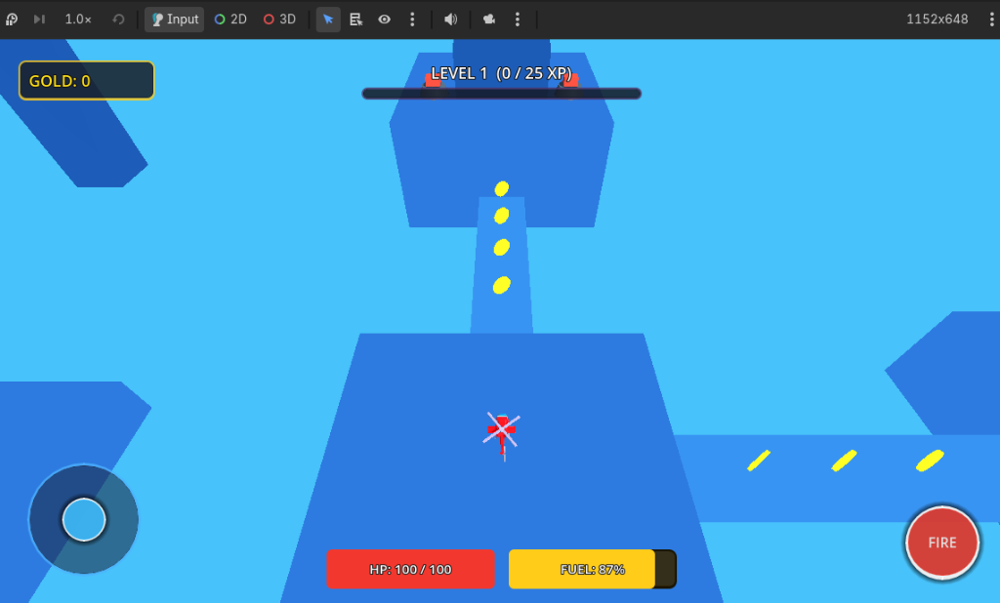

# Godot Heli Havoc Like Clone

An arcade 3D helicopter combat & flight game built with **Godot 4.7 Engine**, inspired by *Heli Havoc*.



---

## 🚁 Gameplay Overview

Fly freely in 360 degrees through a floating low-poly arena made of chunky geometric blocks, elevated rooftop platforms, and connecting bridges. Dodge incoming turret projectiles, strafe around obstacles, blast rooftop defense turrets from alternating side mounts, and collect trails of coins, fuel, and XP to level up.

---

## 🎮 Controls

| Input | Action |
| :--- | :--- |
| **W** | Move Screen/Camera Forward |
| **S** | Move Screen/Camera Backward |
| **A** | Move Screen/Camera Left |
| **D** | Move Screen/Camera Right |
| **W + A / W + D / S + A / S + D** | Instant 360° Diagonal Movement |
| **Left Click / Spacebar** | Continuous Dual Blaster Fire |
| **Virtual Joystick** | Mobile touch 360° analog steering |
| **FIRE Button** | Mobile weapon trigger |

---

## ✨ Features

### 1. 360° Omnidirectional Flight Mechanics
- **Camera-Relative Vector Projection:** Movement directions map to screen/camera space rather than helicopter yaw heading.
- **Immediate Arcade Physics:** Fast acceleration (`110 m/s²`), rapid deceleration (`125 m/s²`), and top speed (`32 m/s`) with zero sluggish turning radius or inertia delay.
- **Dynamic Visual Banking:** The helicopter visibly banks up to `30°` into lateral turns and pitches `16°` on acceleration/reversal while the physics capsule stays strictly upright.
- **Locked Flight Altitude:** Clean altitude stabilization at `6.0m`.

### 2. Custom GLB Helicopter & Rotor Animation
- Custom imported GLB model (`body.glb`, `top propeller.glb`, `back propeller.glb`).
- **Main Rotor:** Continuously rotates on local Y-axis (`35 rad/s`).
- **Tail Rotor:** Mounted directly on the rear tail fin axle, rotating on local X-axis (`55 rad/s`).
- Rotors spin independently of physics banking without orbiting or clipping.

### 3. Floating Low-Poly Geometric Arena
- Chunky BoxMesh platforms at varying heights (3m, 8m, 12m, 16m).
- 40–50% open air void between platforms for dramatic verticality.
- Vibrant arcade aesthetic: bright cyan sky, shaded blue platforms with crisp directional sunlight, and distant horizon fog.

### 4. Tactical Combat & Projectiles
- **7 Red Rooftop Turrets:** Smooth Y-axis player tracking with line-of-sight raycasting.
- **Dodgeable Enemy Fire:** Large, glowing orange/red plasma spheres traveling at `24 m/s` for readable dodge windows.
- **Alternating Dual Side Blasters:** Fires rapidly (`50 m/s` yellow bolts) alternating between Left and Right weapon hardpoints.

### 5. Progression, Pickups & Upgrades
- **Structured Trails:** Gold coins across bridges, purple XP cubes on high towers, and red fuel cans in risk zones.
- **Fuel System:** Continuous fuel consumption with canister refills (+25).
- **Run-Based Upgrades:** Leveling up pauses gameplay and presents 3 random card upgrades (*Movement Speed, Max Fuel, Fuel Efficiency, Pickup Magnet Radius, Max Health, Weapon Damage, Fire Rate*).

---

## 🛠️ How to Run

1. Clone this repository:
   ```bash
   git clone https://github.com/ArnavNah/Godot-Heli-Havoc-Like-Clone.git
   ```
2. Open **Godot Engine 4.7+** (or Godot 4.x Standard/GL Compatibility).
3. Import `project.godot`.
4. Press **F5** (or click **Play**) to launch `scenes/game/floating_arena.tscn`.
